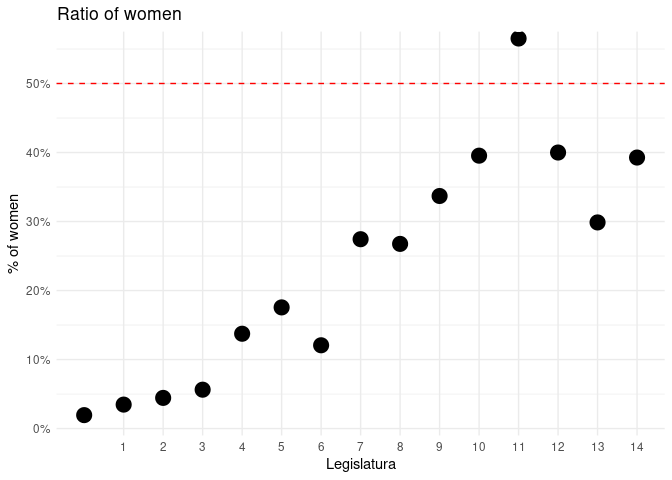
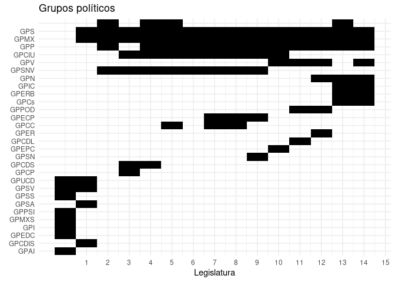

<!-- README.md is generated from README.Rmd. Please edit that file -->

# senadoRES

<!-- badges: start -->

<!-- badges: end -->

The goal of senadoRES is to provide information about the [Senate of
Spain](https://en.wikipedia.org/wiki/Senate_of_Spain). It uses the [Open
Data](https://www.senado.es/web/relacionesciudadanos/datosabiertos/catalogodatos/index.html)
available.

## Installation

You can install the released version of senadoRES from
[CRAN](https://CRAN.R-project.org) with:

``` r
install.packages("senadoRES")
```

or

``` r
remotes::install_github("llrs/senadoRES")
```

## Example

This is a basic example which shows you how to solve a common problem:

``` r
library("senadoRES")
library("dplyr")
#> 
#> Attaching package: 'dplyr'
#> The following objects are masked from 'package:stats':
#> 
#>     filter, lag
#> The following objects are masked from 'package:base':
#> 
#>     intersect, setdiff, setequal, union
library("ggplot2")
```

We can see the increase of females on the Senate:



Or the change of the parties along the years:


