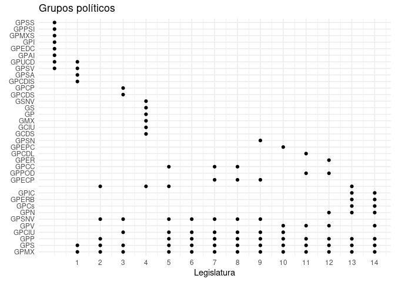

<!-- README.md is generated from README.Rmd. Please edit that file -->

# senadoRES

<!-- badges: start -->

<!-- badges: end -->

The goal of senadoRES is to provide information about the [Senate of
Spain](https://en.wikipedia.org/wiki/Senate_of_Spain). It uses the [Open
Data](https://www.senado.es/web/relacionesciudadanos/datosabiertos/catalogodatos/index.html)
available.

## Installation

You can install the released version of senadoRES from
[CRAN](https://CRAN.R-project.org) with:

``` r
install.packages("senadoRES")
```

or

``` r
remotes::install_github("llrs/senadoRES")
```

## Example

This is a basic example which shows you how to solve a common problem:

``` r
library("senadoRES")
library("dplyr")
#> 
#> Attaching package: 'dplyr'
#> The following objects are masked from 'package:stats':
#> 
#>     filter, lag
#> The following objects are masked from 'package:base':
#> 
#>     intersect, setdiff, setequal, union
library("ggplot2")
```

We can see the increase of females on the Senate:

``` r
ts <- senadores()
ts %>%
    group_by(legislatura) %>%
    count(sex) %>%
    mutate(total = sum(n)) %>%
    filter(!is.na(sex)) %>%
    mutate(ratio = n/total) %>%
    filter(sex != "male") %>% 
    ggplot() +
    geom_point(aes(legislatura, ratio, col = sex, shape = sex), size = 5) +
    geom_hline(yintercept = 0.5, linetype = 2, col = "red") +
    scale_x_continuous(breaks = seq_len(15)) +
    scale_y_continuous(labels = scales::percent_format(accuracy = 1), 
                       breaks = seq(from = 0, to = 0.7, by = .1),
                       expand = expansion(add = c(0, 0.01)), limits = c(0, NA)) +
    theme_minimal() +
    labs(title = "Ratio of women", x  = "Legislatura", y = "% of women") +
    guides(col = FALSE, shape = FALSE)
```


``` r


ts %>% 
    group_by(legislatura) %>%
    count(grupoNombre) %>% 
    ggplot() +
    geom_point(aes(legislatura, forcats::fct_reorder2(grupoNombre, legislatura != 0, legislatura, .fun = sum))) +
    scale_x_continuous(breaks = seq_len(15)) +
    theme_minimal() +
    labs(title = "Grupos políticos", x  = "Legislatura", y = element_blank())
```



Or the change of the parties along the years
